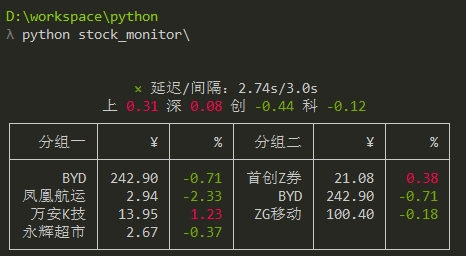
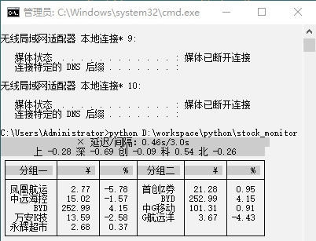
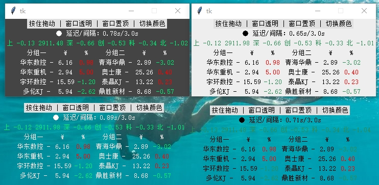

### 控制台/GUI窗口，轮询展示行情




### Features
- 支持查询沪深京主要指数、个股、ETF，支持分组。
- 涨跌幅可配置红绿着色，也可不着色。
- 开市时段，自动轮询，可配置轮询间隔。闭市时段，查询一次后结束。
- GUI窗口模式可自定义颜色主题和字体大小，切换透明窗口（点击window_mode按钮）、启用置顶。
- 控制台模式，按`Ctrl + C`键退出。

### Usage
- 需要Python 3.7.0以上, `pip install`安装以下库：`requests`, `requests[socks]`, `rich`, `tkinter`。
- 编辑`local.json`中的`stock_groups`，个股代码的sh/sz/bj前缀建议加、也可不加。
- 用任意命令行终端运行本仓库即可，比如Windows的cmd或Powershell。   
```
python your_path/stock_monitor --gui
```
- 命令行可追加`--gui`参数，强制使用GUI窗口模式，默认以`config.json`中的`gui`配置项为准。
- tips: 可以右击cmd的属性，修改背景和文字颜色，然后`Ctrl+鼠标滚轮`缩放（图二），使之更隐蔽。

### config.json
- `proxy`: **如果担心网络抓包，可连接代理转移网络流量，否则请删除此项、或留白{}**。
- `eastmoney`: 东财网页版的配置项，用来获取你的东财账号的自选股，暂未实现。
- `colorize`: 涨跌幅是否区分红绿着色。
- `interval_seconds`: 请求间隔，单位秒，支持小数，请求太频繁可能被远端屏蔽。
- `price_arrows`: 可指定价格涨跌箭头，将你期望的箭头字符放到最前面即可，顺序是上箭头下箭头。
- `gui`相关项: GUI窗口的开关、置顶、字体大小、颜色主题。

### local.json
- `market_indices`: 市场主要指数，代码**必须**加sh/sz/bj前缀，名字将缩略只展示首汉字。
- `stock_groups`: 本地配置个股和分组。
- `stock_name_hiding_enable`: 个股名称隐蔽，开关。
- `stock_name_hidings`: 个股名称隐蔽，尽量减少被路人发现。