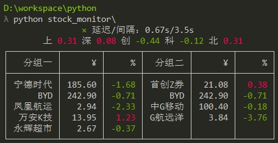

### 控制台实时展示大A行情

### Features
- 支持展示沪深京三市主要指数、个股。
- 支持个股分组。
- 涨跌幅可区分红绿着色，也可不区分。
- 开市时段，自动刷新查询，可配置查询间隔。闭市时段，查询一次后结束。
- 按`Ctrl + C`键退出。

### Usage
- 需要Python 3, 并且先`pip install`安装`requests`, `requests[socks]`, `rich`三个库。
- 编辑`local.json`中的`local_stock_groups`，个股代码的sh/sz/bj前缀建议加、也可不加。
- 用任意命令行终端运行本仓库即可，比如Windows的cmd或Powershell。

### config.json 
- `proxy`: **如果担心公司抓包，可连接代理转移网络流量，否则请删除、留空白**。
- `eastmoney`: 东财网页版的配置项，用来获取你的东财账号的自选股，暂未实现。
- `colorize`: 涨跌幅是否区分红绿着色。
- `interval_seconds`: 请求间隔，单位秒，支持小数，请求太频繁可能被远端屏蔽。

### local.json
- `market_indices`: 市场主要指数，代码**必须**加sh/sz/bj前缀，名字将缩略只展示首汉字。
- `stock_groups`: 本地配置个股和分组。
- `stock_name_hidings`: 个股名称隐藏，尽量减少被路人发现。